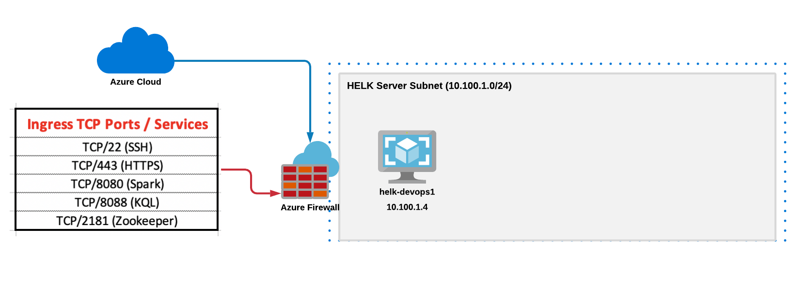

# Overview:  HELK_Azure with Option 1
Automated Terraform deployment of HELK in Azure!  This option only builds HELK (no endpoints) and uses the recommended installation with an Ubuntu Linux VM.  This option deploys an Azure VM with hardware for Option #4 and installs HELK option #4.

# Quick Fun Facts:
* Deploys one (1) Ubuntu Linux 18.04 HELK Server ~ Deploys HELK with Hardware and automated deployment #4 option
* Uses Terraform templates to automatically deploy in Azure with VMs
* Terraform VM modules are flexible, allowing you to add your own new VMs in Azure
* Terraform templates write Ansible Playbook configuration, which can be customized
* Deployment Time:  Approximately 12 minutes 
* Azure Network Security Groups (NSGs) can whitelist your source prefix, for added security
* The following ports are opened through Azure NSGs for ingress TCP traffic:  SSH (22), HTTPS (443), Spark (8080), KQL (8088), Zookeeper (2181)

# Infrastructure and Credentials
* HELK Linux OS username:  helk (Uses SSH public key auth)
* HELK Kibana Administrator Password for https port 443:  helk:hunting
* Server Subnet (HELK):  10.100.1.0/24
* HELK Internal IP:  10.100.1.4

# Remote Access (After Deployment)
* HELK Server:  View contents of hosts.cfg.  The second line should show the IP address of the HELK server that is provisioned a public IP from Azure.  You can SSH to the host from within that directory:
```
$ ssh -i ssh_key.pem helk@<IP ADDRESS>
```
* Kibana GUI:  Use the step above to get the public Azure IP address of the HELK Server.  Use Firefox browser to navigate to:
```
https://<IP ADDRESS>
```

**Note:**  Tested on Ubuntu Linux 20.04 

# Requirements
* Azure subscription
* Terraform:  Tested on v0.13.4
* Ansible:  Tested on 2.9.6


## Installation Steps

**Note:**  Tested on Ubuntu 20.04

**Step 1:** Install Terraform and Ansible on your Linux system

Download and install Terraform for your platform --> https://www.terraform.io/downloads.html

Install Ansible
```
$ sudo apt-get install ansible
```

**Step 2:** Set up an Azure Service Principal on your Azure subscription that allows Terraform to automate tasks under your Azure subscription

Follow the exact instructions in this Microsoft link:
https://docs.microsoft.com/en-us/azure/developer/terraform/getting-started-cloud-shell

These were the two basic commands that were run based on this link above:
```
az ad sp create-for-rbac --role="Contributor" --scopes="/subscriptions/<subscription_id>
```
and this command below.  From my testing I needed to use a role of "Owner" instead of "Contributor".  Default Microsoft documentation shows role of "Contributor" which resulted in errors.  
```
az login --service-principal -u <service_principal_name> -p "<service_principal_password>" --tenant "<service_principal_tenant>"
```
Take note of the following which we will use next to configure our Terraform Azure provider:
```
subscription_id = ""
client_id = ""
client_secret = ""
tenant_id = ""
```

**Step 3:** Clone this repo
```
$ git clone https://github.com/iknowjason/HELK_Azure.git
```

**Step 4:** Using your favorite text editor, edit the main.tf file for the Azure resource provider matching your Azure Service Principal credentials

```
cd option1_helk_standalone
vi main.tf
```

Edit these parameters in the main.tf file:
```
subscription_id = ""
client_id = ""
client_secret = ""
tenant_id = ""
```

Your main.tf file should look similar to this but with your own Azure Service Principal credentials:
```
subscription_id = "aa9d8c9f-34c2-6262-89ff-3c67527c1b22"
client_id = "7e9c2cce-8bd4-887d-b2b0-90cd1e6e4781"
client_secret = ":+O$+adfafdaF-?%:.?d/EYQLK6po9`|E<["
tenant_id = "8b6817d9-f209-2071-8f4f-cc03332847cb"
```


**Step 5:**  Edit the variables.tfvars file to include your source network prefix
Edit the following file:  option1_helk_standalone/variables.tfvars
Uncomment the "src_ip" variable and populate it with your correct source IP address.  If you don't do this, the Azure NSGs will open up your two VMs to the public Internet.  Below is exactly where the variable should be uncommented and an example of what it looks like:
```
# Set variable below for IP address prefix for white listing Azure NSG
# uncomment variable below; otherwise, all of the public Internet will be permitted
# https://ifconfig.me/
# curl https://ifconfig.me
src_ip = "192.168.87.4"
```

**Step 6:** Run the commands to initialize terraform and apply the resource plan

```
$ cd option1_helk_standalone
$ terraform init
$ terraform apply -var-file=variables.tfvars -auto-approve
```

This should start the Terraform automated deployment plan


# Shutting down / cleaning up
```
$ cd option1_helk_standalone
$ terraform destroy
```
